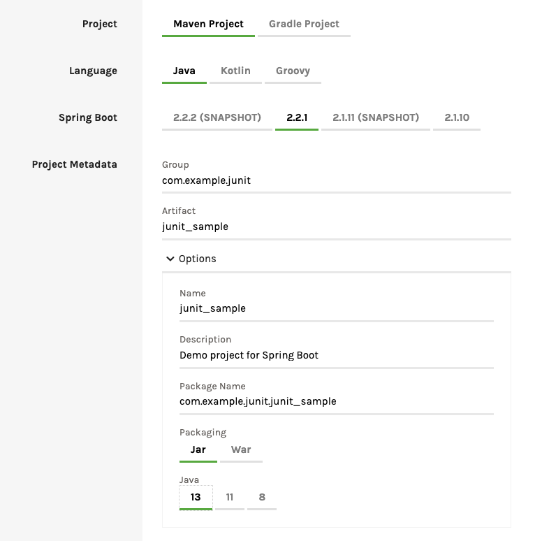
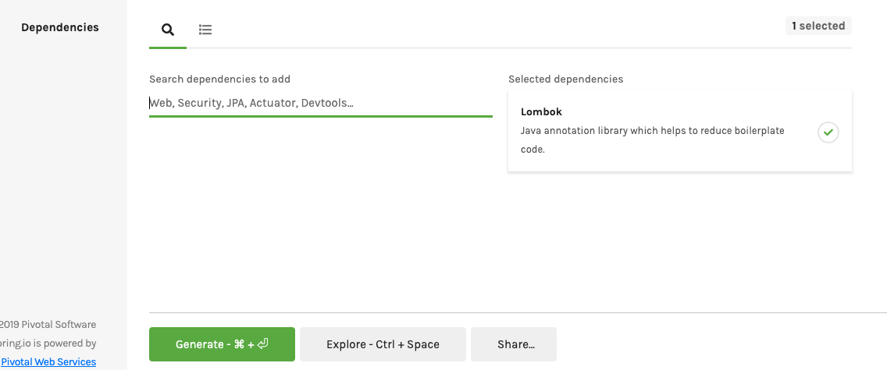

# Junit5 Example

Junit 5에 대해서 오늘은 알아볼 예정입니다.

최근 스프링 부트 어플리케이션을 구성하면 'junit-jupiter-engine' 이 자동 탑재되어 있으며, 이전에 사용하던 Junit 4 를 이용하려면 별도 의존서을 설치해 주어야합니다.

이번 아티클에서는 Junit 5 에 대해서 알아보고, 사용 예를 살펴보고자 합니다.

ref: [https://www.baeldung.com/junit-5](https://www.baeldung.com/junit-5)

## 개발환경 구성하기.

우선 Junit 테스트를 수행하기 위해서 프로젝트를 생성해보겠습니다.

[https://start.spring.io](https://start.spring.io) 을 방문합니다. 이 사이트는 스프링 프로젝트 템플릿을 몇가지 설정으로 생성해주는 사이트입니다.





위 내용과 같이 작업해줍니다.

junit 5는 자동으로 내장되어 있기 때문에 의존성은 Lombok 만 등록해 보겠습니다. (편라히니까요 ^^)

## pom.xml 살펴보기

스프링에서 가장먼저 할 일은 pom.xml 파일을 찾거나, build.gradle 파일을 찾아보는 것입니다.

IDE 에 프로젝트를 로드했다면 pom.xml 을 열어봅니다.

```
		<dependency>
			<groupId>org.springframework.boot</groupId>
			<artifactId>spring-boot-starter-test</artifactId>
			<scope>test</scope>
			<exclusions>
				<exclusion>
					<groupId>org.junit.vintage</groupId>
					<artifactId>junit-vintage-engine</artifactId>
				</exclusion>
			</exclusions>
		</dependency>
```

위와 같이 스프링 부트 스타터 테스트가 로드되어 있음을 알 수 있습니다.

junit-vintage-engine 는 exclusion 되어 있는것을 보면 과거 버전의 junit 을 사용하지 않는것을 알 수 있습니다.

이는 junit 4 버젼을 이용하기 위한 의존성 파일입니다. 여기서 exclusion 되어 있으니 junit 5만 지원하는것을 아시겠죠?

## Junit 5 구성요소.

1. Junit Platform:

- 이것은 JVM 에서 테스트 프레임워크를 런칭하는 역할을 합니다.
- Junit 과 클라이언트 사이에 안정적이고 강력한 인터페이스를 제공한다.
- 테스트를 찾고, 실행하기 위해서 클라이언트와 JUnit 간의 통합을 제공합니다.

2. Junit Jupiter

Junit 5 에서는 새로운 확장 모듈과 사용방법을 제공합니다.

- @TestFactory: 동적 테스트를 위한 테스트 팩토리를 제공합니다.
- @DisplayName: 테스트 클래스나 메소드에 대해서 사용자가 표시할 이름을 지정할 수 있습니다.
- @Nested: 어노테이트된 테스트가 중첩되어 있다는 것을 알려줍니다. 이것은 non-static 테스트 클래스입니다.
- @Tag: 테스트를 필터링 하기 위한 태그를 선언합니다.
- @ExtendWith: 사용자 확장을 등록하기 위해 사용된다.
- @BeforeEach: 어노테이트된 메소드는 각 테스트 메소드가 수행되기 전에 처리된다. (이전의 @Before와 동일)
- @AfterEach: 각 테스트 메소드가 수행되고 나서 어노테이트된 메소드가 실행된다. (이전의 @After와 동일)
- @BeforeAll: 현재 클래스에서 모든 테스트 메소드가 수행되기 전에 어노테이트된 메소드가 실행된다. (이전의 @BeforeClass와 동일)
- @AfterAll: 현재 클래스에서 모든 테스트 메소드가 수행되고난 뒤 어노테이트된 메소드가 실행된다. (이전의 @AfterClass와 동일)
- @Disable: 이것은 테스트 클래스 혹은 메소드를 비활성화 시킨다. (이전의 @Ignore와 동일)

3. Junit Vintage

이는 Junit3, Junit4 를 Junit5 플랫폼 내에서 수행할 수 있도록 하는 모듈입니다.

## Test Sample 이해하기.

우리는 이번 예제에서 나누기 연산을 수행하는 클래스를 만들고 이를 테스트 해보도록 하겠습니다.

### 계산기 코드 작성하기.

#### Operation.java 인터페이스 생성

```
/**
 * Operation
 */
public interface Operation<T> {

    T operate(T lvalue, T rvalue);

}
```

#### 나누기를 위한 코드 작성

```
/**
 * DivideInt
 */
public class DivideInt implements Operation<Integer> {

    @Override
    public Integer operate(Integer lvalue, Integer rvalue) {
        checkRvalue(rvalue);
        return lvalue / rvalue;
    }

    public void checkRvalue(Integer rvalue) {
        if (rvalue == 0) {
            throw new IllegalArgumentException("RValue can't be zero");
        }
    }

}
```

보시는 바와 같이 Lvalue, Rvalue 를 파라미터로 받아서 나누리를 수행합니다.

만약 Rvalue 가 0이 오면 잘못된 아규먼트가 들어왔다는 예외를 던지는 코드입니다.

#### 계산기 클래스 생성하기.

```
/**
 * Calculator
 */
public class Calculator<T> {

    Operation<T> operation;

    public Calculator(Operation<T> operation) {
        this.operation = operation;
    }

    public T calculate(T lvalue, T rvalue) {
        T returnValue = operation.operate(lvalue, rvalue);

        System.out.println("Lvalue: " + lvalue + " RValue: " + rvalue + " Result: " + returnValue);

        return returnValue;
    }
}
```

### Test Case 코드 작성하기.

src/test/java/com/example/junit/junit_sample/calculator/CalculatorTest.java 에 다음 파일을 만듭니다.

```
package com.example.junit.junit_sample.calculator;

import static org.junit.jupiter.api.Assertions.assertAll;
import static org.junit.jupiter.api.Assertions.assertEquals;
import static org.junit.jupiter.api.Assertions.assertThrows;
import static org.junit.jupiter.api.Assertions.assertTrue;
import static org.junit.jupiter.api.Assumptions.assumeFalse;
import static org.junit.jupiter.api.Assumptions.assumeTrue;
import static org.junit.jupiter.api.Assumptions.assumingThat;

import org.junit.jupiter.api.AfterAll;
import org.junit.jupiter.api.AfterEach;
import org.junit.jupiter.api.BeforeAll;
import org.junit.jupiter.api.BeforeEach;
import org.junit.jupiter.api.Disabled;
import org.junit.jupiter.api.DisplayName;
import org.junit.jupiter.api.Test;

/**
 * CalculatorTest
 */
@DisplayName("계산기 테스트를 수행하는 클래스이다.")
public class CalculatorTest {

    Calculator<Integer> calculator;

    @BeforeAll
    static void setup() {
        System.out.println("@Before All: 테스트 클래스 단위로 가장 먼저 실행된다.");
    }

    @BeforeEach
    void init() {
        System.out.println("@BeforeEach: 각 테스트가 수행될 때마다 초기화를 수행한다. 보통 테스트 데이터를 초기화 한다. ");

        calculator = new Calculator<>(new DivideInt());
    }

    @DisplayName("단순 테스트")
    @Test
    void displayTest() {
        System.out.println("@Test: 테스트를 수행하기 위한 어노테이션");
    }

    @Test
    @Disabled("테스트를 건너 뜁니다.")
    void ignoreTest() {
        System.out.println("로그가 찍히는지 확인해보세요. ");
    }

    @DisplayName("AssertTrue Test")
    @Test
    void normalDivideTest() {
        assertTrue(calculator.calculate(10, 10) == 1, () -> "divided done");
    }

    @DisplayName("AssertAll Test")
    @Test
    void normalDivideTest2() {
        assertAll("AssertAll description", () -> assertEquals(calculator.calculate(10, 10), 1),
                () -> assertEquals(calculator.calculate(10, 5), 2), () -> assertEquals(calculator.calculate(10, 2), 5));
    }

    @DisplayName("Assumption Test, assumeTrue(), assumeFalse(), assumingThat()")
    @Test
    void assumptionTest() {
        assumeTrue(10 > 0);
        assumeFalse(10 < 0);
        assumingThat(calculator != null, () -> assertEquals(calculator.calculate(10, 10), 1));
    }

    @DisplayName("Exception Test")
    @Test
    void parameterErrorTest() {
        Throwable exception = assertThrows(IllegalArgumentException.class, () -> calculator.calculate(10, 0));

        assertEquals(exception.getMessage(), "RValue can't be zero");
    }

    @AfterEach
    void tearDown() {
        System.out.println("@AfterEach: 는 각 테스트가 끝날때 수행된다. 테스트 자원을 정리할때 보통 이용합니다.");
    }

    @AfterAll
    static void done() {
        System.out.println("@AfterAll: 는 전체 테스트가 마무리되고 나서 수행이 된다.");
    }

}
```

#### @DisplayName

우리가 살펴보는 샘플처럼 테스트에 대한 설명을 기술합니다.

class 단위, method 단위로 추가할 수 있습니다.

#### @BeforeAll, @BeforeEach

@BeforeAll 어노테이션은 클래스 단위로 테스트가 들어가기 전에 한번 수행합니다.

@BeforeEach 이는 각 테스트 메소드가 수행될때마다 초기화 합니다. 일반적으로 테스트 데이터를 초기화 하거나, 우리의 예제처럼 객체를 생성하는 등의 준비를 수행합니다.

```
    @BeforeAll
    static void setup() {
        System.out.println("@Before All: 테스트 클래스 단위로 가장 먼저 실행된다.");
    }

    @BeforeEach
    void init() {
        System.out.println("@BeforeEach: 각 테스트가 수행될 때마다 초기화를 수행한다. 보통 테스트 데이터를 초기화 한다. ");

        calculator = new Calculator<>(new DivideInt());
    }
```

#### @Test, @Disabled

@Test 어노테이션을 추가하면 테스트를 수행합니다. 테스트 클래스에서는 반드시 하나의 @Test 는 있어야합니다.

@Disabled 어노테이션은 테스트를 스킵합니다. 클래스단위, 테스트 메소드 단위에 각각 지정할 수 있으며, 테스트를 수행하지 않습니다.

```
    @DisplayName("단순 테스트")
    @Test
    void displayTest() {
        System.out.println("@Test: 테스트를 수행하기 위한 어노테이션");
    }

    @Test
    @Disabled("테스트를 건너 뜁니다.")
    void ignoreTest() {
        System.out.println("로그가 찍히는지 확인해보세요. ");
    }
```

#### assertTrue, assertAll

assertTrue 는 테스트 결과의 참과 거짓을 측정할 수 있습니다.

assertAll 은 여러세트의 테스트를 묶어서 한번에 테스트를 수행할 수 있습니다.

```
    @DisplayName("AssertTrue Test")
    @Test
    void normalDivideTest() {
        assertTrue(calculator.calculate(10, 10) == 1, () -> "divided done");
    }

    @DisplayName("AssertAll Test")
    @Test
    void normalDivideTest2() {
        assertAll("AssertAll description",
                () -> assertEquals(calculator.calculate(10, 10), 1),
                () -> assertEquals(calculator.calculate(10, 5), 2),
                () -> assertEquals(calculator.calculate(10, 2), 5));
    }
```

#### assumeTrue(), assumeFalse(), assumingThat()

assumeTrue() : 해당 검증이 참이 되어야 다음으로 넘어갈 수 있습니다.
assumeFalse() : 해당 검증이 거짓이 되어야 다음으로 넘어갈 수 있습니다 .
assumingThat() : 첫번째 파라미터가 참일때, 다음 검증을 수행합니다.

```
    @DisplayName("Assumption Test, assumeTrue(), assumeFalse(), assumingThat()")
    @Test
    void assumptionTest() {
        assumeTrue(10 > 0);
        assumeFalse(10 < 0);
        assumingThat(calculator != null, () -> assertEquals(calculator.calculate(10, 10), 1));
    }
```

#### Exception Test

예외에 대한 테스트를 수행할때에는 assertThrows 를 이용할 수 있습니다.

반환되는 값은 Throwable 로 변수로 받을 수 있으며, 이후 처리도 수행할 수 있습니다.

```
    @DisplayName("Exception Test")
    @Test
    void parameterErrorTest() {
        Throwable exception = assertThrows(IllegalArgumentException.class, () -> calculator.calculate(10, 0));

        assertEquals(exception.getMessage(), "RValue can't be zero");
    }
```

#### @AfterEach, @AfterAll

@AfterEach 는 각 테스트 메소드가 끝나면 매번 수행됩니다.

@AfterAll 은 테스트 마무리시에 수행됩니다.

```
    @AfterEach
    void tearDown() {
        System.out.println("@AfterEach: 는 각 테스트가 끝날때 수행된다. 테스트 자원을 정리할때 보통 이용합니다. 일반적으로 테스트 리소스 정리를 tearDown 이라고 부릅니다.");
    }

    @AfterAll
    static void done() {
        System.out.println("@AfterAll: 는 전체 테스트가 마무리되고 나서 수행이 된다.");
    }
```

## 결론

지금까지 Junit 5에 대한 주요 어노테이션과 테스트를 살펴 보았습니다.

설명한 부분은 매우 기본적인 사항들에 대해서만 작성한 것이며, Mokito 와 내장된 Matcher 를 같이 이용하면, 테스트 커버리지를 향상 시킬 수 있도록 테스트 flow 를 조정할 수 도 있습니다.
